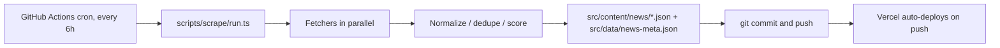

# Hantavirus Cruise Tracker

An English-language, fact-first static tracker of the Hantavirus cruise outbreak. Built with
Astro, hosted on Vercel, refreshed every six hours by a GitHub Actions cron job that commits
fresh source items back to the repo (Vercel auto-deploys on push).

The site is **fully static**: no server, no database, no client-side framework. All the
"liveness" comes from the scrape job committing fresh source items back to the repo, which
re-triggers a Pages build.



## Quick start

```bash
pnpm install
pnpm dev          # local server at http://localhost:4321
pnpm build        # produces dist/
pnpm scrape:dry   # run the pipeline without writing files
pnpm scrape       # run live (writes src/content/news + src/data/news-meta.json)
pnpm test         # vitest unit tests for the scrape pipeline
```

Node 20.10 or newer is required.

## Editing content

| What you want to change | Where |
| --- | --- |
| Outbreak name, ship name, status chip, case counts | `src/data/stats.json` |
| Ship metadata, itinerary, ports of call | `src/data/cruise.json` |
| Curated timeline events | `src/content/timeline/*.json` |
| Long-form primer (about page) | `src/content/explainer/*.mdx` |
| FAQ entries | `src/content/faq/*.mdx` |
| Visual theme (colors, type, spacing) | `src/styles/tokens.css` |

Every collection has a Zod schema in `src/content/config.ts`. The dev server type-checks
your edits against it.

## Adding a new source to the scraper

The scraping pipeline is built around a single tiny interface so new sources never touch
the renderer:

```ts
// scripts/scrape/types.ts
export interface Fetcher {
  name: string;
  sourceType: "official" | "news" | "social";
  fetch(ctx: FetchContext): Promise<NewsItem[]>;
}
```

To add, e.g., the UK Health Security Agency RSS feed:

1. Create `scripts/scrape/fetchers/ukhsa.ts` exporting a `Fetcher` (use any of the existing
   fetchers as a template).
2. Register it in the `FETCHERS` array in `scripts/scrape/run.ts`.
3. Add a fixture under `scripts/scrape/__fixtures__/` and a unit test verifying the
   normalized output.
4. Open a PR. The `Refresh sources` workflow runs the test suite and a dry-run scrape on
   every PR; merging triggers the next live run on the cron schedule.

No other code in the project needs to change. The `sourceType` you choose drives the
scoring weight (`official=1.0`, `news=0.6`, `social=0.3`) and the badge color in the UI.

## Deployment

Hosting is on **Vercel**. Connect the GitHub repo once on
[vercel.com/new](https://vercel.com/new) — Vercel auto-detects Astro from `vercel.json`,
builds with `pnpm build`, and deploys on every push to `main` (preview deployments on PRs).

For a custom domain, add it in the Vercel project's **Settings → Domains**. Vercel handles
DNS hints, certificate issuance, and HTTPS automatically. Optionally set the `SITE_URL`
environment variable to your canonical URL so RSS / sitemap absolute links match — without
it, `astro.config.mjs` falls back to `VERCEL_PROJECT_PRODUCTION_URL`, which Vercel injects
during the build.

The scrape cron stays on GitHub Actions; it commits fresh JSON back to `main`, which Vercel
picks up automatically and redeploys. No Vercel-side cron is needed.

## Editorial principles

- **Every fact links to a primary source.** Sourceless claims do not belong on this site.
- **History is preserved.** Snapshots in `stats.json` are append-only; we do not silently
  rewrite numbers when authorities revise them.
- **Trust tiers are visible.** Official health-agency notices, mainstream news, and social
  signals are clearly badged and ranked, never blurred together.

## Disclaimer

This site is independent and not affiliated with any health authority or cruise operator.
Information is provided without warranty. Consult your country's official public-health
authority before making travel or medical decisions.
